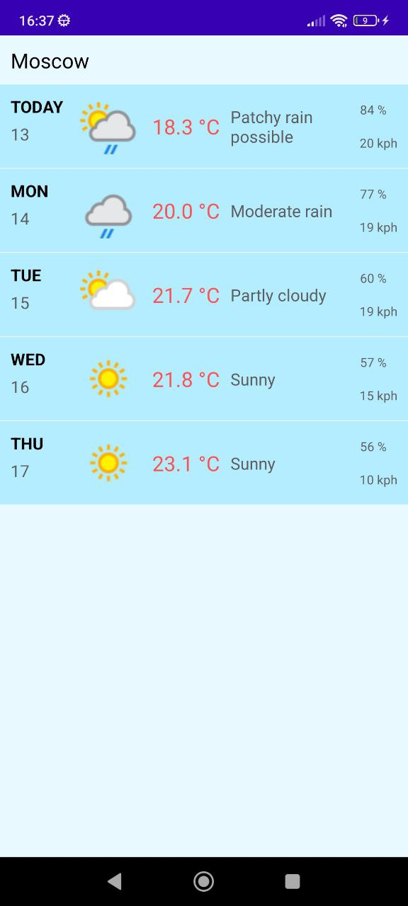

# WeatherApp

WeatherApp is a simple Android application that provides weather forecasts for a selected city. It allows users to view weather data for the next 5 days, including today's weather.

## Features

- Display weather forecasts for the next 5 days.
- Retrieve weather data from the free WeatherAPI.
- User-friendly UI with a vertical list of weather information for each day.

## Dependencies

- Kotlin: A modern programming language for Android development.
- Dagger Hilt: A dependency injection framework for Android.
- Retrofit: A type-safe HTTP client for networking.
- Glide: A fast and efficient image loading library.
- ViewModel: A part of the Android Architecture Components for managing UI-related data.
- Kotlin Coroutines: A powerful tool for handling asynchronous operations.

## Screenshots

